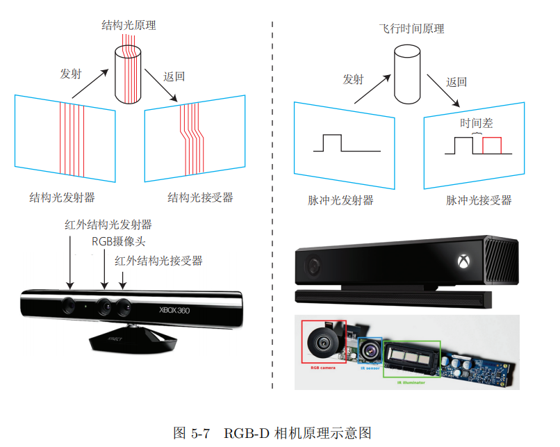

# RGBD相机模型

RGBD相机是主动投射式相机，发射模块通过按照特定频率向外发射红外光束，接受模块接受照射在障碍物上并漫反射回来的光线，从而计算出照射物体距离摄像头的距离以及xyz坐标，以及强度信息等。深度相机原理分为两类：分别是红外结构光以及tof结构。

## 1.红外结构光（Structured Light）
原理：通过红外激光发射器，将具有一定结构特征的光线投射在对应物体上，反射光线由红外接收器接收。这种具备一定结构的光线，会因被摄物体的不同深度，得到不同的图像相位信息，从而通过运算单元将这种结构的变化换算成深度信息，以此获得三维结构

## 2.tof（Time-of-flight光飞行时间）
原理：打出的红外线束碰到障碍物后会发生漫反射，接收器接收到反射回的光线之后，得到时间差t，光的速度是v=300000km/s，则障碍物的距离d=v*t/2.Tof相机的原理与激光雷达相似，传统单线、16线、32线激光雷达都是按照一定的旋转周期旋转循环逐点扫描，而tof相机是片状发射。所以tof相机得到的同一帧点云之间没有时间差，做slam时不需要进行运动补偿；而机械结构式的激光雷达因为需要扫描一周，在车速较快的情况下，扫描的起始点和结束点往往距离相差较远，需要做运动补偿。

## 3.应用
一般机构光结构的深度相机由于容易受到日光照射的影响不能用于室外，tof结构相机一般可用于室外。

常见红外结构深度相机：微软 Kinect-1、英特尔 RealSense大部分款式

常见tof深度相机：微软 Kinect-2、IFM车用3D摄像头等

